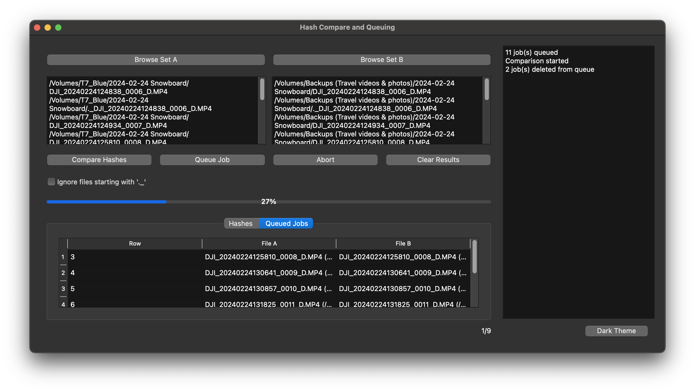
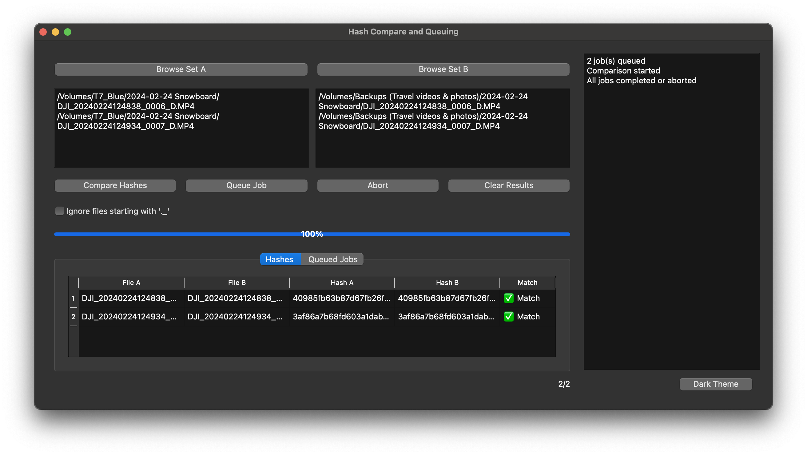

  

<h1 align="center">Hash Compare & Queue</h1>

  

  

  🪟 Windows · 🍎 macOS · 🐧 Linux

---

## ℹ️ About — What is this program?

**Hash Compare & Queue** (HCQ) is a hashing, comparing and more importantly queueing program (yes, I know, duh) for validating that two sets of files are identical and non-corrupt. I made this because I video edit on a Mac, which is a much less free platform, where everyone wants to charge for any amount of polish. More importantly, I've never seen a program on any OS (possibly I didn't search hard enough) that allows you to queue up you files to hash compare. Thus this program is born! I wanted to keep it free because that's precisely why I made it in the first place - I couldn't find a free program that does this - so it seems a little hypocritical to charge for it. I'll take [donations](https://buymeacoffee.com/hashcomparator) though if you want to buy me a coffee or a meal ;)

<h3>☕ Use case</h3>

  Normally, you start up comparing 10 files, you get up to get a coffee or go to the bathroom and you come back, you have to wait until the existing operation is done before you can add more files. With HCQ, you can add 10 files, get up, come back and attach another drive, add 35 more files, find even more files, and add another 105 files to the queue, and it will just keep chugging along.

---

## ✨ Features

- 🖱️ **Drag & drop** files or folders into Set A / Set B  
- 📂 **Browse** buttons for easy folder selection  
- 🔗 **Auto-pair by filename** and **queue** the jobs  
- 🚦 **Threaded** compare for a responsive UI  
- 📏 **Early size check** (skip hashing if sizes differ)  
- ⏹️ **Abort** mid-run (per row or global)  
- ⌫ **Delete** to remove selected queued jobs  
- ⏳ **Live progress** with percent overlay and counts  
- 🧾 **System log** panel for actions & statuses  
- 🙈 **Ignore `._` files** option (macOS resource forks)

---

## 🐞 Issues?

Spotted a bug or want a feature? Please open an **Issue** with:  
- 💻 OS (Windows/macOS/Linux) & version  
- 🏷️ App version (release tag)  
- 🔁 Steps to reproduce  
- 🧩 Relevant snippet from **System Messages** (if any)  
*(Please avoid sharing proprietary files.)*

---

## 🖼️ Showcase

**🧺 Queue**
  

**✅❌ Results — Match**
  

---

## 📦 Installation

**Portable app — no installer.**

Simply download🧳 the archive for your OS from **Releases**. Unzip it and keep the _internal folder and the executable together and run the executable (Mac version doesn't have an _internal folder). The _internal folder contains dependancies the app needs.

---

## 🗑️ Uninstallation

Just **delete the folder** containing the app and the _internal folder.

---

## 🚀 Getting Started

1. ➕ Add files/folders to **Set A** and **Set B** using **Browse** or **drag & drop**.  
2. 🙈 (Optional) Enable **“Ignore files starting with '._'”** when comparing macOS directories.  
3. 🧮 Click **Queue Job** to auto-pair files (by **matching filename** across both sets.)  
4. (Optional) 🧺 Review **Queued Jobs** to remove any mistaken selections (select row → **Delete/Backspace**).  
5. ⚙️ Click **Compare Hashes** to start.  
6. 👀 Watch **progress** & **System Messages**.  
7. 🟢 Results appear in **Hashes** as:  
   - **✅ Match** – hashes identical  
   - **❌ Mismatch** – hashes differ  
   - **📏 Size mismatch** – sizes differ (hashing skipped)  
   - **🛑 Aborted** / **⚠️ Error**  

---

## 📜 License

License: Proprietary Freeware (PFL). Free for personal/educational/internal evaluation.
Redistribution, modification, reverse-engineering, and commercial use are not permitted.
Please share via the official release link rather than passing files.
For commercial licensing, contact hashcomparator@gmail.com
© 2025 liamdou
